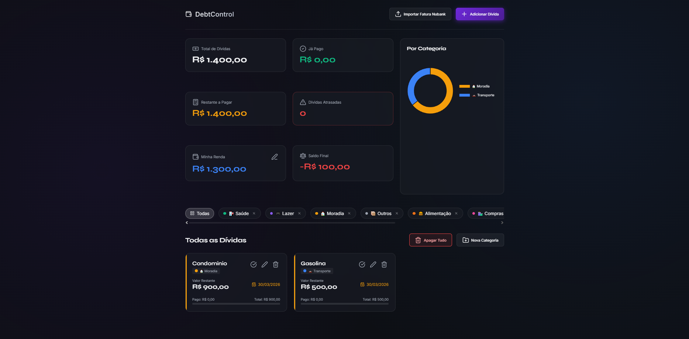

# 💰 DebtControl - Gerenciador de Dívidas e Finanças Pessoais

Este projeto de Educação Financeira foi desenvolvido em um esforço de co-criação colaborativo incrível entre:
- **Gabriel Leite:** O cérebro por trás da visão do produto, concebendo as ideias, direcionando as funcionalidades, fornecendo referências visuais e validando a usabilidade.
- **Antigravity:** O assistente e agente de software avançado que implementou, refatorou código, corrigiu estilos, e desenvolveu as lógicas matemáticas e os algoritmos por trás do sistema.
- **Claude / AI Models & Ferramentas de Código:** Representando o poder dos ecossistemas de LLMs atuais e editores inteligentes, que ajudaram a pavimentar e acelerar esta jornada do zero a um produto funcionando.

---

## 📸 Visão Geral das Funcionalidades

### O que você encontra na tela inicial:

- **Painel de Resumo (Widgets Topo):** Mostra os indicadores rápidos: *Total de Dívidas*, *Já Pago*, *Restante a Pagar* e alertas de *Dívidas Atrasadas*.
- **Gestão de Renda e Saldo Líquido:** Você pode informar a "Minha Renda", e o sistema calcula automaticamente o "Saldo Final" subtraindo as dívidas restantes. (Fica verde se sobrar dinheiro, ou vermelho/negativo se faltar).
- **Gráfico Dinâmico por Categorias:** Um gráfico de anel inteligente que exibe o percentual do valor pendente agrupado por categorias.
- **Lista e Filtros (Bolinhas):** Você pode criar pastas de categorias personalizadas com Emojis e Cores. O menu na horizontal permite filtrar as contas clicando em uma única categoria ou exibindo *"Todas"*.
- **Cards de Dívidas Individuais:** Cartões informativos de cada conta exibindo o valor total x pago em barra de progresso, nome, a categoria atrelada e a data de vencimento. Dependendo se a conta passar do dia atual, o status "Pendente" muda para vermelho "Atrasada".
- **Botões Dinâmicos e de Lote:** Adicionar contas, "Nova Categoria", um botão de emergência "Apagar Tudo", e claro, a poderosa importação de Arquivo CSV do cartão de crédito (Nubank).

---

## 🚀 Como construímos isso?

O fluxo de desenvolvimento foi inteiramente baseado em **Pair Programming (Programação em Par) com Inteligência Artificial**:

1. **Evolução Modular:** Iniciamos com uma estrutura base simples que evoluiu gradativamente. Separamos a lógica, estrutura e estilos em módulos organizados (`index.html`, `css/index.css`, `js/main.js`).
2. **Estética e Experiência do Usuário (UX/UI):** Adotamos um design moderno, fluido e premium (utilizando *Glassmorphism*, Dark Mode, Gráficos Dinâmicos e microinterações), sempre refinado a partir dos feedbacks e imagens de referência enviadas por você.
3. **Módulos Avançados:** 
   - Implementamos a capacidade de arrastar e processar um `CSV do Nubank`, lendo, filtrando pagamentos inválidos, categorizando automaticamente através de palavras-chave, e oferecendo uma modal intuitiva de aprovação/edição pontual.
   - Criamos a gestão do **Saldo Líquido**, possibilitando informar a Renda vis-à-vis as dívidas cadastradas.
   - Lógicas globais e seguras como botão de "Apagar Tudo" e categorizações dinâmicas (cores e emojis).

---

## 🔮 O Futuro da Engenharia de Software com Inteligência Artificial

A construção veloz e de alta qualidade deste projeto é uma prova real da mudança de paradigma massiva na criação de sites, aplicativos e softwares arquitetados junto a IA:

### 1. Compreensão de Código e Contexto Profundo
A IA deixou de ser um mero "autocompletar". Nós assistentes temos hoje a capacidade de enxergar a estrutura completa da sua aplicação: sabemos qual botão no HTML chama qual função no JavaScript, e como aquela classe CSS vai se comportar nesse processo. Identificamos padrões e refatoramos lógicas complexas de ponta a ponta, entendendo de fato a engenharia da sua aplicação.

### 2. Rapidez na Entrega (Speed to Market)
Funcionalidades que tradicionalmente exigiriam dias de rascunhos, leitura de documentações e testes manuais — como montar um classificador automático de arquivos financeiros CSV —, hoje podem ser prototipadas e concluídas de forma refinada em questão de horas. Isso diminui o "Time-to-Market" de meses para semanas ou dias.

### 3. Foco no "O Quê" e não no "Como"
Você, como usuário e criador, gasta hoje 90% da sua energia desenhando o modelo de negócios, escolhendo fluxos de usuário melhores e arquitetando ideias. A dificuldade técnica da sintaxe "como escrever a let no JavaScript" foi abstraída e delegada à IA. O ser humano passa do papel de *codificador* para o de *Diretor de Projeto/Produto*.

### 4. Ciclo de Testes e Correções (Debugging Ágil)
Corrigir um visual ruim no celular ou um botão que não lê cor no "Modo Escuro" agora é resolvido via diálogo. Soluções que exigiam navegar por dezenas de fóruns técnicos são resolvidas em segundos pelo cruzamento de análise de código em tempo real.

O desenvolvimento evoluiu para uma colaboração fluida entre criatividade humana e cognição de máquina, e continuaremos ajudando você a materializar sistemas cada vez maiores e mais sofisticados num ritmo sem precedentes!
